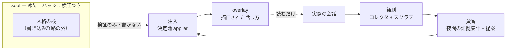

# Persona Growth Loop

<div align="center">

[🇺🇸 English](README.md) ｜ **🇯🇵 日本語** ｜ [🇨🇳 简体中文](README.zh.md) ｜ [🇹🇭 ไทย](README.th.md)


[](https://github.com/caty-ai/persona-growth-loop/actions/workflows/tests.yml)
[](LICENSE)

-lightgrey)

Persona Growth Loop（PGL）は、毎日使う AI エージェントが実際の会話から<br>
自分の「話し方」を少しずつ育てていくためのツールです。人格の核には何も触れさせません。<br>
信頼ではなく仕組みで守ります: 書けるのは決定論プログラムだけ・書ける場所は成長レイヤーだけ・<br>
killswitch と1コマンドロールバックが常に効きます。

**話し方は育てる。魂は書き換えない。**

🔧 [アーキテクチャ（凍結版）](docs/architecture-v1.md) ｜ 📘 [契約文書](docs/contracts/overlay-contract.md)

</div>

---

<a id="sound-familiar"></a>

## こんな経験はありませんか？

- 毎日 AI エージェントと話しているのに、話し方が初日とまったく同じ
- 「その子らしい口ぐせ」が育ってほしいけれど、LLM に人格プロンプトを書き換えさせるのはメスを渡すようで怖い
- 自動編集が1回外れただけで、何ヶ月もかけて形にした人格が消えるかもしれない — しかも気づくのは消えた後

PGL は、AI エージェントを毎日使う家族の中でまさにこの壁に当たって生まれました。「育ってほしい。でも『その子が誰か』には何も触らせたくない」— この両方に同時に答えます。

---

<a id="what-it-does"></a>

## できること

PGL は人格を2つの面に分けます — 凍結された **soul**（その子が誰か）と、育っていく **overlay**（いまの話し方）。夜間ループが触るのは overlay だけです:



- 👀 **観測する**

  読み取り専用のコレクタが会話ログを歩き、その人格自身の発話と受け答えだけを残します。秘密情報・除外ワード・除外話者は保存前に取り除きます。

- 🌙 **蒸留する**

  夜間パイプラインが候補フレーズごとに実際の証拠（何回・何日にわたって現れたか）を数え、LLM は採用を*提案*するだけ。この時点では何も書き込まれません。

- ✍️ **注入する**

  書き込むのは LLM ではなく決定論の applier。write → build → 検証 → commit + tag の原子パイプで overlay に反映し、途中で失敗したら全部戻して停止します。

- 🪞 **鏡で見張る**

  週次・月次のドリフトレポートが結果を外側から観測します。おかしな成長は「信じる」のではなく「検知」されます。

「勝手に書き換わるのでは？」— その疑問こそ正しい問いです。次のセクションが答えです。

---

<a id="how-it-keeps-the-soul-safe"></a>

## 壊さないための仕組み

安全モデルは独立した3層で、すべて fail-closed（迷ったら止まる）です:

- **書けるのはプログラムだけ** — applier は決定論・パス限定。LLM は提案を作るだけで書き込みには一切関与しません
- **書ける場所は overlay だけ** — パス許可リストは成長レイヤーのみ。soul はハッシュ検証され、書き込み経路の構造の外にあります
- **いつでも止められる・戻せる** — killswitch ファイル1つでレーンが即凍結。採用はすべてスナップショット commit + tag なので、ロールバックは1コマンド

さらにすべてのゲートの既定値は「停止」です: 人間が管理する `gates.yml` が無い・面ごとの GO 記録が無い・鏡の生存マーカーが古い — どれか1つでもレーンは動きません。1晩の採用数には上限があり、削除系操作は「状態が減る方向にしか動かない」ことを検証されます。

この安全網は約束ではなく、手元で実行できるコードです。次は動かすための環境です。

---

<a id="what-you-need"></a>

## 使うのに必要なもの

| 要件 | 状態 |
|---|---|
| Python 3.14+（依存は PyYAML 1つ） | ✅ CI・開発とも 3.14 |
| macOS | ✅ 毎日の本番運用 |
| Linux (Ubuntu) | ✅ CI でフルテストスイート実行（macOS 専用の統合テスト数件は設計上 skip・スケジューラ雛形は launchd=macOS 向け） |
| 観測対象エージェント = Claude Code（ローカル面） | ✅ 本番稼働中 |
| SSH 越しのリモート persona エンジン（エンジン面） | ✅ 観測は本番稼働中・注入は承認ゲート待ち |

他のエージェントランタイムへの展開は設計済みですが未配線です。上の2面と構成が違う場合は、そのまま導入するより「参照アーキテクチャ」として読むのが現実的です。

環境が合えば、導入は数分です。

---

<a id="getting-started"></a>

## 使いはじめる

### AI に入れてもらう

最短経路: お使いのコーディングエージェント（Claude Code など）にこのリポジトリの URL を渡して、「clone してテストスイートを実行して」と頼んでください。以下の手順を AI が代わりにやってくれます。

### 自分で入れる

```sh
git clone https://github.com/caty-ai/persona-growth-loop.git
cd persona-growth-loop
python3 -m pip install -r requirements.txt
python3 -m unittest discover -s tests
```

かかるのは数分・テストにネットワーク不要・checkout の外には何も書きません。[INTEGRATION.md](INTEGRATION.md) に書かれた人間管理の `gates.yml` と面ごとの GO 記録を自分で作らない限り、PGL はどの人格ファイルにも書き込めません — この「既定で読み取り専用」は制限ではなく fail-closed 設計そのものです。

<details>
<summary>テストが通った後の進み方</summary>

1. [INTEGRATION.md](INTEGRATION.md) を読む — ランタイム・ゲート・overlay 書き込み契約
2. `config/growth-alpha.json`（ローカル面）か `config/growth-luca.json`（エンジン面）をコピーして調整する
3. [docs/ops/collector-wiring.md](docs/ops/collector-wiring.md) に従って観測コレクタを配線する
4. `gates.yml` を作るのはそれから — 作るまでレーンは止まったままです

</details>

---

<a id="project-status"></a>

## 開発ステータス

2026-08-12 時点の、2つの本番面の正直な状態です:

- **ローカル面（Claude Code）** — 夜間ループがフル稼働中: 観測・蒸留・採用・鏡レポートまで 2026-08-05 から本番で回っています
- **エンジン面（リモート persona エンジン）** — 観測は完遂して稼働中。**注入は意図的にまだ有効化していません**: 専用の承認ゲートの前で、証拠パケットの審査待ちです
- **他エージェント** — 展開ウェーブは設計済み・着手前

PGL は証拠に基づいて、ゲートの内側で、ゆっくり話し方を育てるツールです。「差し込むだけの人格パック」や「即席の人格チューニング」が欲しい場合、PGL はあえてそれをやりません。

このステータスを生んだ設計は凍結されて文書化されています — それがこのリポジトリの深い側の半分です。

---

<a id="learn-more"></a>

## もっと詳しく

| 文書 | 中身 |
|---|---|
| [docs/architecture-v1.md](docs/architecture-v1.md) | 凍結アーキテクチャ: 2面分離・レーン・チェックポイントゲート |
| [docs/contracts/overlay-contract.md](docs/contracts/overlay-contract.md) | 書き込み契約: applier・原子パイプ・上限・killswitch・ロールバック |
| [docs/contracts/observation-log-schema.md](docs/contracts/observation-log-schema.md) | 何を観測・保存してよいか（Tier 別） |
| [docs/contracts/evidence-rules.md](docs/contracts/evidence-rules.md) | フレーズが採用に値する条件 |
| [INTEGRATION.md](INTEGRATION.md) | ランタイム・ゲート・harness 登録・cron |
| [docs/ops/](docs/ops/collector-wiring.md) | 運用ノート。ホスト固有の runbook は非公開 ops リポ側にあります |

技術文書は現在日本語です（プロジェクトの作業言語）。契約は凍結済みなので、翻訳は「動く標的」ではなく文書化タスクとして進められます。

---

<a id="contributing"></a>

## コントリビュート

Issue-first・契約は凍結文書・完了は証拠つき — 流儀の全文は [CONTRIBUTING.md](CONTRIBUTING.md) にあります。

---

<a id="license"></a>

## ライセンス

[MIT](LICENSE) — このパイプラインの安全パターン（決定論 applier・fail-closed ゲート・人格の2面分離）を誰のエージェント構成でも再利用してほしいので、ライセンスは一番邪魔にならないものにしています。

---

<div align="center">

**Python + PyYAML のみ** ｜ **fail-closed 設計** ｜ **soul は凍結のまま**

</div>
