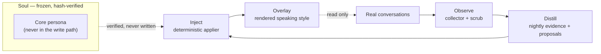

# Persona Growth Loop

<div align="center">

**🇺🇸 English** ｜ [🇯🇵 日本語](README.ja.md) ｜ [🇨🇳 简体中文](README.zh.md) ｜ [🇹🇭 ไทย](README.th.md)


[](https://github.com/caty-ai/persona-growth-loop/actions/workflows/tests.yml)
[](LICENSE)


Persona Growth Loop (PGL) lets a long-running AI agent grow its own speaking style<br>
from real conversations — while its core personality stays frozen and untouchable.<br>
It works by structure, not by trust: only a deterministic program can write,<br>
only into a separate growth layer, behind a kill switch and one-command rollback.

**Grow the voice. Never rewrite the soul.**

🔧 [Architecture (frozen)](docs/architecture-v1.md) ｜ 📘 [Contracts](docs/contracts/overlay-contract.md)

</div>

---

<a id="sound-familiar"></a>

## Sound familiar?

- You talk to your AI agent every day, but it speaks exactly like it did on day one
- You would love it to pick up its own favorite phrases, but letting an LLM rewrite its persona prompt feels like handing it a scalpel
- One bad automated edit could erase a personality you spent months shaping — and you might not notice until it is gone

PGL was built inside a family of daily-driven AI agents that hit exactly this wall: we wanted our agents to grow, and we refused to let anything automated touch who they are. PGL answers both wishes at once.

---

<a id="what-it-does"></a>

## What it does

PGL splits a persona into two planes — a frozen **soul** (who the agent is) and a growing **overlay** (how it currently talks) — and runs a nightly loop that only ever touches the overlay:



- 👀 **Observe**

  A read-only collector walks conversation transcripts, keeps only what the persona itself said and heard, and strips secrets, denylisted terms, and excluded speakers before anything is stored.

- 🌙 **Distill**

  A nightly pipeline counts real evidence for each candidate phrase (how often it appears, over how many days) and lets an LLM *propose* adoptions. Proposals are just proposals — nothing is written yet.

- ✍️ **Inject**

  A deterministic applier — not an LLM — writes the adopted phrases into the overlay through an atomic pipe: write → build → verify → commit + tag. Any failure reverts everything and stops the lane.

- 🪞 **Mirror**

  Weekly and monthly drift reports watch the result from outside, so growth that goes wrong is detected instead of trusted.

"Won't it rewrite my agent behind my back?" is the right question — the next section is the answer.

---

<a id="how-it-keeps-the-soul-safe"></a>

## How it keeps the soul safe

The safety model is three independent layers, all of which fail closed:

- **Only a program can write** — the applier is deterministic and path-scoped; LLMs generate proposals and nothing else
- **Only the overlay can be written** — a path allowlist covers the growth layer alone; the soul is hash-verified and structurally outside the write path
- **You can always stop or undo** — a kill-switch file freezes the lane instantly, and every adoption is a snapshot commit with a tag, so rollback is one command

Around those layers, every gate defaults to *stopped*: no human-owned `gates.yml`, no per-face GO decision, or a stale liveness marker each means the lane simply does not run. Nightly adoptions are capped, and deletion operations must provably only shrink state.

This safety net is not a promise — it is code you can run. Which brings us to what you need.

---

<a id="what-you-need"></a>

## What you need

| Requirement | Status |
|---|---|
| Python 3.11+ (single dependency: PyYAML) | ✅ CI-tested on 3.11, developed on 3.14 |
| macOS | ✅ daily production use |
| Claude Code as the observed agent (local face) | ✅ in production |
| A remote persona engine over SSH (engine face) | ✅ observation in production; injection behind its approval gate |

> **Note:** Linux is not verified yet — parts of the test suite assume macOS filesystem layout. Tracked in [issue #1](https://github.com/caty-ai/persona-growth-loop/issues/1); the CI runs an advisory Linux job.

Other agent runtimes are a design goal of the rollout plan but are not wired yet — if your setup differs from the two faces above, treat PGL as a reference architecture rather than a drop-in.

If this matches your environment, setup takes a few minutes.

---

<a id="getting-started"></a>

## Getting started

### Ask your AI agent

The shortest path: give your coding agent (Claude Code or similar) this repository URL and ask it to *clone the repo and run the test suite*. Everything below is what it will do for you.

### Do it yourself

```sh
git clone https://github.com/caty-ai/persona-growth-loop.git
cd persona-growth-loop
python3 -m pip install -r requirements.txt
python3 -m unittest discover -s tests
```

A few minutes, no network access needed by the suite, nothing written outside the checkout. Until you deliberately create the human-owned `gates.yml` and per-face GO records described in [INTEGRATION.md](INTEGRATION.md), PGL cannot write to any persona file — the read-only default is the fail-closed design, not a limitation.

<details>
<summary>Where to go after the tests pass</summary>

1. Read [INTEGRATION.md](INTEGRATION.md) — runtimes, gates, and the overlay write contract
2. Copy and adapt `config/growth-alpha.json` (local face) or `config/growth-luca.json` (engine face)
3. Wire the observation collector per [docs/ops/collector-wiring.md](docs/ops/collector-wiring.md)
4. Only then consider creating `gates.yml` — the lane stays off until you do

</details>

---

<a id="project-status"></a>

## Project status

Honest state of the two production faces, as of 2026-08-12:

- **Local face (Claude Code)** — the full nightly loop is live: observation, distillation, adoption, and mirror reports have run in production since 2026-08-05
- **Engine face (remote persona engine)** — observation is complete and running; **injection is intentionally not enabled yet**: it waits behind its own approval gate with an evidence packet under review
- **Other agents** — a rollout wave is designed but not started

PGL grows style slowly, on evidence, behind gates. If you want a plug-and-play personality pack or instant persona fine-tuning, PGL is deliberately not that tool.

The design that produced this status is frozen and documented — that is the deep half of the repository.

---

<a id="learn-more"></a>

## Learn more

| Document | What it holds |
|---|---|
| [docs/architecture-v1.md](docs/architecture-v1.md) | Frozen architecture: two-plane split, lanes, checkpoint gates |
| [docs/contracts/overlay-contract.md](docs/contracts/overlay-contract.md) | The write contract: applier, atomic pipe, caps, kill switch, rollback |
| [docs/contracts/observation-log-schema.md](docs/contracts/observation-log-schema.md) | What may be observed and stored, tier by tier |
| [docs/contracts/evidence-rules.md](docs/contracts/evidence-rules.md) | When a phrase has earned adoption |
| [INTEGRATION.md](INTEGRATION.md) | Runtimes, gates, harness registry entry, cron entries |
| [docs/ops/](docs/ops/collector-wiring.md) | Operator notes; host-specific runbooks stay in the private ops repository |

Technical documents are currently in Japanese (the project's working language); the contracts are frozen, so translations are a documentation task rather than a moving target.

---

<a id="contributing"></a>

## Contributing

Issue-first, contracts are frozen documents, and completion means evidence — the full ground rules live in [CONTRIBUTING.md](CONTRIBUTING.md).

---

<a id="license"></a>

## License

[MIT](LICENSE) — we want the safety patterns in this pipeline (deterministic applier, fail-closed gates, two-plane persona split) to be reusable in anyone's agent stack, so the license gets out of the way.

---

<div align="center">

**Python + PyYAML only** ｜ **fail-closed by design** ｜ **soul stays frozen**

</div>
