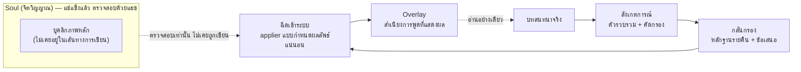

# Persona Growth Loop

<div align="center">

[🇺🇸 English](README.md) ｜ [🇯🇵 日本語](README.ja.md) ｜ [🇨🇳 简体中文](README.zh.md) ｜ **🇹🇭 ไทย**


[](https://github.com/caty-ai/persona-growth-loop/actions/workflows/tests.yml)
[](LICENSE)

-lightgrey)

Persona Growth Loop (PGL) ช่วยให้ AI เอเจนต์ที่ทำงานต่อเนื่องระยะยาว ค่อย ๆ พัฒนาสำเนียงการพูดของตัวเอง<br>
จากบทสนทนาจริง — ในขณะที่แก่นบุคลิกภาพยังคงถูกแช่แข็งและแตะต้องไม่ได้เสมอ<br>
ระบบนี้ทำงานด้วยโครงสร้าง ไม่ใช่ด้วยความไว้ใจ: มีเพียงโปรแกรมที่ทำงานแบบกำหนดผลลัพธ์แน่นอน (deterministic) เท่านั้นที่เขียนข้อมูลได้<br>
และเขียนได้เฉพาะในเลเยอร์การเติบโตที่แยกออกมาต่างหาก โดยมี kill switch และการย้อนกลับด้วยคำสั่งเดียวคอยควบคุมอยู่เบื้องหลัง

**ให้น้ำเสียงเติบโต แต่ไม่มีวันเขียนทับจิตวิญญาณ**

🔧 [สถาปัตยกรรม (แช่แข็งแล้ว)](docs/architecture-v1.md) ｜ 📘 [ข้อตกลง (Contracts)](docs/contracts/overlay-contract.md)

</div>

---

<a id="sound-familiar"></a>

## คุ้นเคยไหม?

- คุณคุยกับ AI เอเจนต์ทุกวัน แต่มันพูดเหมือนเดิมทุกประการเหมือนวันแรกที่เริ่มใช้งาน
- คุณอยากให้มันค่อย ๆ ซึมซับวลีที่มันชอบพูดเอง แต่การปล่อยให้ LLM เขียนพรอมต์บุคลิกภาพของตัวเองใหม่ ก็รู้สึกเหมือนยื่นมีดผ่าตัดให้มันถืออยู่
- การแก้ไขอัตโนมัติที่ผิดพลาดเพียงครั้งเดียว อาจลบล้างบุคลิกภาพที่คุณใช้เวลาหลายเดือนสร้างขึ้นมา — และคุณอาจไม่ทันสังเกตจนกว่ามันจะหายไปแล้ว

PGL ถือกำเนิดขึ้นในครอบครัวที่ใช้ AI เอเจนต์กันทุกวัน และเราชนกำแพงนี้เข้าอย่างจัง: เราอยากให้เอเจนต์ของเราเติบโตขึ้น แต่ก็ปฏิเสธที่จะให้สิ่งใดที่เป็นระบบอัตโนมัติแตะต้อง "ตัวตน" ของพวกมัน PGL ตอบโจทย์ทั้งสองอย่างพร้อมกัน

---

<a id="what-it-does"></a>

## PGL ทำอะไรได้บ้าง

PGL แบ่งบุคลิกภาพออกเป็นสองชั้น — **soul** (จิตวิญญาณ ซึ่งหมายถึงตัวตนของเอเจนต์) ที่ถูกแช่แข็งไว้ และ **overlay** (เลเยอร์ทับ ซึ่งหมายถึงวิธีพูดในปัจจุบัน) ที่เติบโตได้ — จากนั้นรันลูปทุกคืนที่แตะต้องเฉพาะ overlay เท่านั้น:



- 👀 **สังเกตการณ์**

  ตัวรวบรวมข้อมูลแบบอ่านอย่างเดียว (read-only) จะไล่ดูบทสนทนาทั้งหมด เก็บไว้เฉพาะสิ่งที่บุคลิกภาพนั้นพูดและได้ยินเอง พร้อมทั้งตัดข้อมูลลับ คำที่อยู่ในบัญชีดำ และผู้พูดที่ถูกยกเว้นออกก่อนจะบันทึกข้อมูลใด ๆ

- 🌙 **กลั่นกรอง**

  ไปป์ไลน์ที่ทำงานทุกคืนจะนับหลักฐานจริงของแต่ละวลีที่เป็นตัวเลือก (ปรากฏบ่อยแค่ไหน ในช่วงกี่วัน) แล้วให้ LLM *เสนอ* ว่าควรรับเข้ามาหรือไม่ ข้อเสนอก็ยังเป็นแค่ข้อเสนอ — ยังไม่มีการเขียนข้อมูลใด ๆ เกิดขึ้น

- ✍️ **ฉีดเข้าระบบ**

  ผู้ที่เขียนวลีที่ได้รับการยอมรับลงใน overlay คือ applier (ตัวประยุกต์ใช้) แบบกำหนดผลลัพธ์แน่นอน ไม่ใช่ LLM โดยทำผ่านไปป์แบบอะตอมมิก: write (เขียน) → build (สร้าง) → verify (ตรวจสอบ) → commit + tag (คอมมิตและติดแท็ก) หากขั้นตอนใดล้มเหลว ระบบจะย้อนกลับทุกอย่างและหยุดเลนนั้นทันที

- 🪞 **ส่องกระจก**

  รายงานความเบี่ยงเบน (drift) รายสัปดาห์และรายเดือนจะคอยเฝ้าดูผลลัพธ์จากภายนอก เพื่อให้การเติบโตที่ผิดพลาดถูก "ตรวจจับ" แทนที่จะถูก "เชื่อใจ" เฉย ๆ

"มันจะแอบเขียนทับเอเจนต์ของฉันโดยที่ฉันไม่รู้หรือเปล่า" คือคำถามที่ถูกต้อง — และหัวข้อถัดไปคือคำตอบ

---

<a id="how-it-keeps-the-soul-safe"></a>

## PGL ปกป้อง soul ได้อย่างไร

โมเดลความปลอดภัยประกอบด้วยสามชั้นที่เป็นอิสระจากกัน และทุกชั้นยึดหลัก fail-closed (หยุดทำงานทันทีเมื่อเกิดปัญหา):

- **มีเพียงโปรแกรมเท่านั้นที่เขียนข้อมูลได้** — applier ทำงานแบบกำหนดผลลัพธ์แน่นอนและถูกจำกัดขอบเขตด้วยเส้นทางไฟล์ ส่วน LLM มีหน้าที่สร้างข้อเสนอเท่านั้น ไม่มีอย่างอื่น
- **มีเพียง overlay เท่านั้นที่ถูกเขียนได้** — บัญชีเส้นทางที่อนุญาต (allowlist) ครอบคลุมเฉพาะเลเยอร์การเติบโตเท่านั้น ส่วน soul ถูกตรวจสอบด้วยแฮชและอยู่นอกเส้นทางการเขียนโดยโครงสร้าง
- **คุณหยุดหรือย้อนกลับได้เสมอ** — ไฟล์ kill switch เพียงไฟล์เดียวจะแช่แข็งเลนนั้นได้ทันที และการรับวลีเข้ามาทุกครั้งจะถูกบันทึกเป็น snapshot commit พร้อมแท็ก จึงย้อนกลับได้ด้วยคำสั่งเดียว

นอกเหนือจากสามชั้นนี้ ทุกเกตจะตั้งค่าเริ่มต้นเป็น *หยุดทำงาน* เสมอ: หากไม่มี `gates.yml` ที่มนุษย์เป็นผู้ดูแล ไม่มีการตัดสินใจ GO สำหรับแต่ละ face หรือมีเครื่องหมายแสดงสถานะทำงาน (liveness marker) ที่เก่าเกินไป เพียงข้อใดข้อหนึ่งก็เพียงพอให้เลนนั้นไม่ทำงานเลย จำนวนวลีที่รับเข้ามาในแต่ละคืนถูกจำกัดเพดานไว้ และการดำเนินการลบข้อมูลต้องพิสูจน์ได้ว่าทำให้สถานะเล็กลงเท่านั้น

เครือข่ายความปลอดภัยนี้ไม่ใช่แค่คำสัญญา — แต่เป็นโค้ดที่คุณรันได้จริง ต่อไปมาดูกันว่าคุณต้องเตรียมอะไรบ้าง

---

<a id="what-you-need"></a>

## สิ่งที่คุณต้องมี

| ข้อกำหนด | สถานะ |
|---|---|
| Python 3.14+ (มีดีเพนเดนซีเดียวคือ PyYAML) | ✅ CI และการพัฒนาใช้ 3.14 |
| macOS | ✅ ใช้งานจริงในโปรดักชันทุกวัน |
| Linux (Ubuntu) | ✅ รันชุดทดสอบเต็มใน CI (มีการข้ามเทสต์เฉพาะ macOS บางรายการโดยตั้งใจ; เทมเพลตตั้งเวลามีเฉพาะ launchd/macOS) |
| ใช้ Claude Code เป็นเอเจนต์ที่ถูกสังเกตการณ์ (local face) | ✅ ใช้งานในโปรดักชันแล้ว |
| เอนจินบุคลิกภาพระยะไกลผ่าน SSH (engine face) | ✅ การสังเกตการณ์ทำงานในโปรดักชันแล้ว ส่วนการฉีดเข้าระบบยังอยู่หลังเกตอนุมัติ |

รันไทม์เอเจนต์อื่น ๆ เป็นเป้าหมายการออกแบบในแผนการเปิดใช้งาน แต่ยังไม่ได้เชื่อมต่อจริง — หากสภาพแวดล้อมของคุณแตกต่างจากสอง face ข้างต้น ควรมอง PGL เป็นสถาปัตยกรรมอ้างอิง มากกว่าจะเป็นระบบที่ใช้งานได้ทันที

หากสภาพแวดล้อมของคุณตรงกับข้างต้น การติดตั้งใช้เวลาเพียงไม่กี่นาที

---

<a id="getting-started"></a>

## เริ่มต้นใช้งาน

### ให้ AI เอเจนต์ของคุณช่วยติดตั้ง

วิธีที่เร็วที่สุด: ส่ง URL ของรีพอสิทอรีนี้ให้โค้ดดิ้งเอเจนต์ของคุณ (Claude Code หรือตัวที่คล้ายกัน) แล้วขอให้มัน *clone รีพอและรันชุดทดสอบ* สิ่งที่อยู่ด้านล่างนี้คือสิ่งที่มันจะทำให้คุณ

### ทำด้วยตัวเอง

```sh
git clone https://github.com/caty-ai/persona-growth-loop.git
cd persona-growth-loop
python3 -m pip install -r requirements.txt
python3 -m unittest discover -s tests
```

ใช้เวลาเพียงไม่กี่นาที ชุดทดสอบไม่ต้องใช้อินเทอร์เน็ต และไม่มีการเขียนไฟล์ใด ๆ นอกโฟลเดอร์ที่ clone มา ตราบใดที่คุณยังไม่จงใจสร้าง `gates.yml` ที่มนุษย์เป็นผู้ดูแล และบันทึก GO ของแต่ละ face ตามที่อธิบายไว้ใน [INTEGRATION.md](INTEGRATION.md) PGL จะไม่สามารถเขียนไฟล์บุคลิกภาพใด ๆ ได้เลย — การตั้งค่าเริ่มต้นแบบอ่านอย่างเดียวนี้ไม่ใช่ข้อจำกัด แต่คือแก่นของการออกแบบแบบ fail-closed

<details>
<summary>หลังจากทดสอบผ่านแล้ว ควรทำอะไรต่อ</summary>

1. อ่าน [INTEGRATION.md](INTEGRATION.md) — รันไทม์ เกต และข้อตกลงการเขียน overlay
2. คัดลอกและปรับแต่ง `config/growth-alpha.json` (local face) หรือ `config/growth-luca.json` (engine face)
3. เชื่อมต่อตัวรวบรวมข้อมูลสังเกตการณ์ตาม [docs/ops/collector-wiring.md](docs/ops/collector-wiring.md)
4. หลังจากนั้นเท่านั้นจึงค่อยพิจารณาสร้าง `gates.yml` — เลนจะยังปิดอยู่จนกว่าคุณจะทำขั้นตอนนี้

</details>

---

<a id="project-status"></a>

## สถานะของโปรเจกต์

สถานะที่แท้จริงของสอง face ในโปรดักชัน ณ วันที่ 2026-08-12:

- **Local face (Claude Code)** — ลูปรายคืนแบบเต็มรูปแบบทำงานอยู่จริง: การสังเกตการณ์ การกลั่นกรอง การรับเข้า และรายงานส่องกระจก ทำงานในโปรดักชันมาตั้งแต่วันที่ 2026-08-05
- **Engine face (เอนจินบุคลิกภาพระยะไกล)** — การสังเกตการณ์เสร็จสมบูรณ์และทำงานอยู่ **การฉีดเข้าระบบยังจงใจไม่เปิดใช้งาน**: มันรอคอยอยู่หลังเกตอนุมัติของตัวเอง พร้อมชุดหลักฐานที่กำลังอยู่ระหว่างการตรวจสอบ
- **เอเจนต์อื่น ๆ** — คลื่นการเปิดใช้งานถูกออกแบบไว้แล้ว แต่ยังไม่เริ่มดำเนินการ
- **v0.2.0** — การยอมรับการดีพลอยแบบสตรีมด้วย status oracle ที่เซสชันเป็นเจ้าของ, ชุดรหัสเหตุผลการปฏิเสธแบบปิด, การ fallback ไปยัง g0 anchor สำหรับ bootstrap รายคืน และ persona CLI ที่เรียกใช้จาก clone ผ่าน node

PGL พัฒนาสำเนียงการพูดอย่างช้า ๆ บนพื้นฐานของหลักฐาน และอยู่หลังเกตเสมอ หากคุณต้องการแพ็กบุคลิกภาพแบบเสียบปุ๊บใช้ปั๊บ หรือการปรับแต่งบุคลิกภาพแบบทันที PGL ตั้งใจไม่ใช่เครื่องมือแบบนั้น

การออกแบบที่ทำให้เกิดสถานะนี้ถูกแช่แข็งและบันทึกไว้เป็นเอกสารแล้ว — นั่นคือครึ่งที่ลึกกว่าของรีพอสิทอรีนี้

---

<a id="learn-more"></a>

## เรียนรู้เพิ่มเติม

| เอกสาร | เนื้อหา |
|---|---|
| [docs/architecture-v1.md](docs/architecture-v1.md) | สถาปัตยกรรมที่แช่แข็งแล้ว: การแบ่งสองชั้น เลน เกตจุดตรวจสอบ |
| [docs/contracts/overlay-contract.md](docs/contracts/overlay-contract.md) | ข้อตกลงการเขียน: applier ไปป์แบบอะตอมมิก เพดานจำกัด kill switch การย้อนกลับ |
| [docs/contracts/observation-log-schema.md](docs/contracts/observation-log-schema.md) | สิ่งที่สังเกตการณ์และจัดเก็บได้ แบ่งตามระดับชั้น |
| [docs/contracts/evidence-rules.md](docs/contracts/evidence-rules.md) | เงื่อนไขที่วลีหนึ่งจะสมควรได้รับการรับเข้า |
| [INTEGRATION.md](INTEGRATION.md) | รันไทม์ เกต รายการลงทะเบียน harness รายการ cron |
| [docs/ops/](docs/ops/collector-wiring.md) | บันทึกของผู้ดูแลระบบ ส่วน runbook เฉพาะโฮสต์เก็บไว้ในรีพอสิทอรี ops ส่วนตัว |

ปัจจุบันเอกสารทางเทคนิคเขียนเป็นภาษาญี่ปุ่น (ภาษาที่ใช้ทำงานของโปรเจกต์นี้) เนื่องจากข้อตกลงต่าง ๆ ถูกแช่แข็งแล้ว การแปลจึงเป็นงานด้านเอกสารทั่วไป ไม่ใช่เป้าหมายที่เปลี่ยนแปลงตลอดเวลา

---

<a id="contributing"></a>

## การมีส่วนร่วม

เริ่มต้นด้วย issue ก่อนเสมอ ข้อตกลงคือเอกสารที่แช่แข็งแล้ว และ "เสร็จสมบูรณ์" หมายถึงต้องมีหลักฐานรองรับ — กติกาฉบับเต็มอยู่ที่ [CONTRIBUTING.md](CONTRIBUTING.md)

---

<a id="license"></a>

## สัญญาอนุญาต

[MIT](LICENSE) — เราต้องการให้รูปแบบความปลอดภัยในไปป์ไลน์นี้ (applier แบบกำหนดผลลัพธ์แน่นอน เกตแบบ fail-closed การแบ่งบุคลิกภาพเป็นสองชั้น) นำไปใช้ซ้ำได้ในสแตกเอเจนต์ของใครก็ได้ สัญญาอนุญาตจึงถูกเลือกให้ไม่เป็นอุปสรรค

---

<div align="center">

**ใช้แค่ Python + PyYAML** ｜ **ออกแบบแบบ fail-closed** ｜ **soul ยังคงแช่แข็งเสมอ**

</div>
